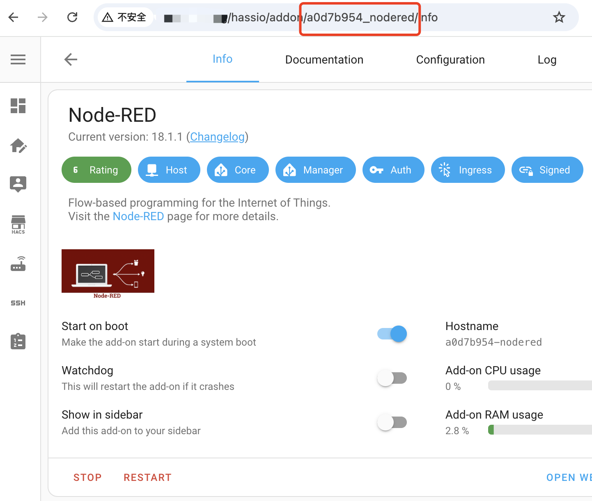
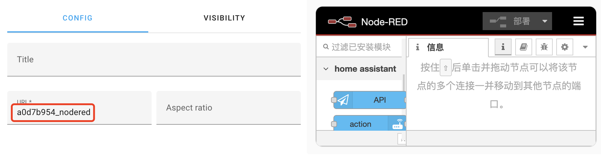

# ha-addon-iframe-card

HA webpage card with addon ingress support.


The [webpage card](https://www.home-assistant.io/dashboards/iframe/) allows you to embed your favorite webpage right into Home Assistant. This custom card `Ingress webpage card` provides support for addon ingress.

**💡 Tip:** If this project helps you, consider giving me a tip for the time I spent building this project:

<a href="https://www.buymeacoffee.com/lovelylain" target="_blank">
  
</a>

## Installation

### HACS

Use this link to directly go to the repository in HACS

[](https://my.home-assistant.io/redirect/hacs_repository/?owner=lovelylain&repository=ha-addon-iframe-card)

_or_

1. Install HACS if you don't have it already
1. Open HACS in Home Assistant
1. Add custom repository https://github.com/lovelylain/ha-addon-iframe-card
1. Search for `Ingress webpage card`
1. Click the download button ⬇️

### Manual

1. Download [addon-iframe-card.js](https://github.com/lovelylain/ha-addon-iframe-card/releases/latest/download/addon-iframe-card.js) file.
2. Put `addon-iframe-card.js` file into your `config/www` folder.
3. Add reference to `addon-iframe-card.js` in Dashboard. There's two way to do that:
   - **Using UI:** _Settings_ → _Dashboards_ → _More Options icon_ → _Resources_ → _Add Resource_ → Set _Url_ as `/local/addon-iframe-card.js` → Set _Resource type_ as `JavaScript Module`.
     **Note:** If you do not see the Resources menu, you will need to enable _Advanced Mode_ in your _User Profile_
   - **Using YAML:** Add following code to `lovelace` section.
     ```yaml
     resources:
       - url: /local/addon-iframe-card.js
         type: module
     ```

## Usage

This card has the same configuration options as the [webpage card](https://www.home-assistant.io/dashboards/iframe/#yaml-configuration). When the `url` is an `addon-slug` or `addon-slug/path/url` or contains `/api/hassio_ingress/`, will enable support for addon ingress. Otherwise, it is exactly the same as a normal webpage card. You can get the addonSlug from the addon info url.




For example:

```yaml
type: custom:addon-iframe-card
url: a0d7b954_nodered/ui/
```
